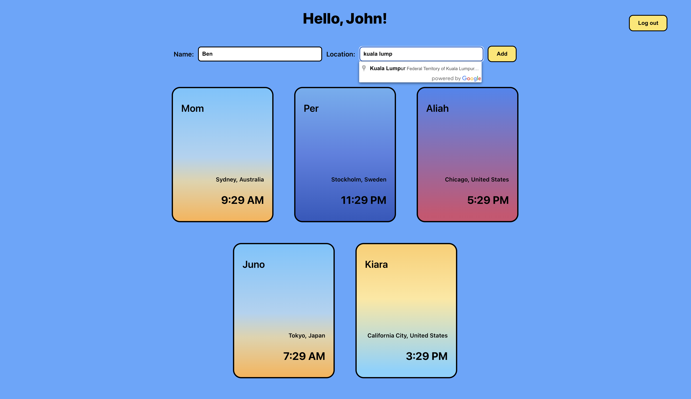

# People World Clock
People World Clock is a full-stack web application built during a hack day at Salt Bootcamp. The application allows users to see the current time in different parts of the world and assign the timezones to people.

The application is built with TypeScript using React for the frontend, Express JS for the backend, and MongoDB for the database.

## Features
- Create a simple account and login
- View the current time in different parts of the world.
- Assign people to timezones by adding name and location to view them as individual cards in the application.
- Delete the timezone cards.
- Visualize the time of day with ease using gradients for morning, afternoon, evening, and night using React Class fuction with CSS gradient. 

## Requirements
To run this application locally you need **Docker** and **Node.js**.

## Installation
To run the application, follow these steps:

1. Clone the repository: git clone https://github.com/{yourusername}/people-world-clock.git
1. Replace the API_KEY with your Google Maps API key (read more in the APIs section)
1. Install dependencies in backend directory: `npm install`
1. Install dependencies in react-frontend directory: `npm install`
1. Start the local database by running `npm run docker` inside the backend directory
1. Start the backend server by running `npm run dev` in the backend directory
1. Start the frontend by running `npm run start` in the react-frontend directory
1. Open the application in your browser at http://localhost:3000

To reset the database run `docker compose down --volumes` in the backend diretory.

## APIs
This project use 2 external APIs from Google Cloud to fecth the autocompleted locations and get the timezone. You will need Google Cloud access key
in order to use them. More information about how you can request the API key:

- https://developers.google.com/maps/documentation/timezone/overview
- https://developers.google.com/maps/documentation/places/web-service/autocomplete

## Future Improvement Suggestions
- [ ] After Sign Up, currently the user needs to fill their credentials in the Log In section instead of being redirected.
- [ ] The account system is quite basic at the moment. It does not have any complex features to protect against attacks such as brute force attacks.
- [ ] The configuration including database credentials are currently hard-coded. They should be moved to environment variables.

## Technologies Used
- TypeScript
- React
- Express JS
- MongoDB
- Docker

## Contributing
If you would like to contribute to this project, please follow these steps:

1. Fork the repository
2. Create a new branch: git checkout -b new-feature
3. Make changes and commit them: git commit -m 'Add new feature'
4. Push to the branch: git push origin new-feature
5. Submit a pull request

## License
This project is licensed under the MIT License. See the LICENSE file for more information.

## Acknowledgements
This project was built during a hack day at Salt Bootcamp. Special thanks to the organizers and Salt's instructors for their support and guidance.